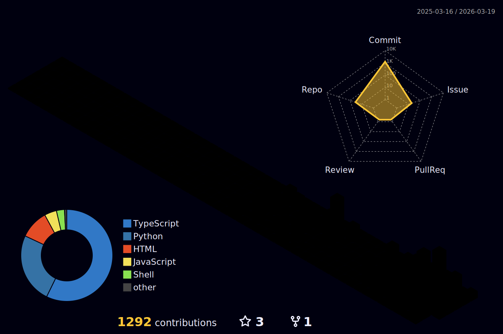

<div align="center">

<!-- ANIMATED HEADER -->


<!-- TYPING EFFECT -->
[](https://step1ne.com)

<br>

<!-- TOP BADGES -->

&nbsp;
[](https://step1ne.com)
&nbsp;
[](https://www.linkedin.com/in/jacky-chen-41736a2b9/)

</div>

---

<!-- PORTFOLIO SHOWCASE -->
<div align="center">

## 💼 AI 自動化顧問作品集

<a href="https://jackyprofile.aijob.com.tw/">

</a>

<br><br>

<table>
<tr>
<td align="center" width="33%">
<a href="https://jackyprofile.aijob.com.tw/">

<br><br>
<b>🤖 AI 顧問服務</b>
<br>
<sub>為企業打造 AI 驅動的<br>獵頭自動化工作流</sub>
</a>
</td>
<td align="center" width="33%">
<a href="https://step1ne.com">

<br><br>
<b>🎯 STEP1NE 獵才平台</b>
<br>
<sub>獵才好選擇 求職好夥伴<br>AI 驅動的人才媒合</sub>
</a>
</td>
<td align="center" width="33%">
<a href="https://www.linkedin.com/in/jacky-chen-41736a2b9/">

<br><br>
<b>🤝 商業合作</b>
<br>
<sub>歡迎 LinkedIn 聯繫<br>探討 AI 自動化合作</sub>
</a>
</td>
</tr>
</table>

</div>

---

## `$ whoami`

```js
const step1ne = {
    name: "Jacky Chen",
    brand: "STEP1NE",
    role: "獵頭顧問 × AI 自動化顧問",
    company: "step1ne.com — 獵才好選擇 求職好夥伴",
    portfolio: "jackyprofile.aijob.com.tw",
    location: "Taiwan 🇹🇼",
    mission: "用 AI 重新定義獵頭顧問的工作方式",
    superpower: "不寫程式，但用 AI 打造出工程師級的自動化系統",
    currentFocus: "獵頭工作流程全面 AI 自動化",
};
```

<div align="center">

> *「每一步自動化，都是為了把時間還給真正重要的事 — 人與人的連結。」*

</div>

---

## 🧠 What I Do

<table>
<tr>
<td width="50%">

### 🎯 AI-Powered Recruitment
- 候選人智能搜尋與匹配
- 自動化履歷篩選與評分
- AI 面試排程與跟進
- 客戶需求智能分析

</td>
<td width="50%">

### ⚡ Workflow Automation
- 端到端獵頭流程自動化
- CRM 數據整合與同步
- 自動化報告生成
- 多平台訊息自動發送

</td>
</tr>
</table>

<div align="center">

[](https://jackyprofile.aijob.com.tw/)

</div>

---

## 🛠️ Tech & Tools

<div align="center">

#### 🤖 AI & LLM


#### 🔄 Automation & No-Code
-6D00CC?style=for-the-badge&logo=make&logoColor=white)


#### 💻 AI-Assisted Development


</div>

---

## 🐍 Contribution Snake

<div align="center">

<picture>
  <source media="(prefers-color-scheme: dark)" srcset="https://raw.githubusercontent.com/jacky6658/jacky6658/output/github-snake-dark.svg" />
  <source media="(prefers-color-scheme: light)" srcset="https://raw.githubusercontent.com/jacky6658/jacky6658/output/github-snake.svg" />
  
</picture>

</div>

---

## 📊 GitHub Stats

<div align="center">


</div>

<br>

<!-- ACTIVITY GRAPH -->
<div align="center">

[](https://github.com/jacky6658)

</div>

---

## 🏙️ 3D Contribution Graph

<div align="center">

<picture>
  <source media="(prefers-color-scheme: dark)" srcset="./profile-3d-contrib/profile-night-rainbow.svg" />
  <source media="(prefers-color-scheme: light)" srcset="./profile-3d-contrib/profile-south-season-animate.svg" />
  
</picture>

</div>

---

## 🚀 Featured Projects

<div align="center">

<!-- 當你建立了實際的 repo 後，把 repo 名稱替換進來 -->
<a href="https://github.com/jacky6658">

</a>
&nbsp;&nbsp;
<a href="https://github.com/jacky6658">

</a>

</div>

<br>

<details>
<summary><b>📂 更多專案（點擊展開）</b></summary>
<br>

| 專案 | 說明 | 技術 |
|------|------|------|
| 🤖 **AI Candidate Matcher** | 基於 LLM 的候選人與職缺智能匹配系統 | `GPT API` `Python` |
| 📊 **Recruitment Dashboard** | 獵頭顧問績效追蹤與數據視覺化 | `Notion` `Make` |
| 📧 **Auto Outreach System** | 自動化候選人觸及與跟進系統 | `n8n` `Gmail API` |
| 📝 **JD Generator** | AI 驅動的職缺描述生成器 | `Claude API` `Vue.js` |
| 🌐 **step1ne.com** | STEP1NE 官方網站 — 獵才媒合平台 | `Nuxt.js` `Vue.js` |

</details>

---

## 🗺️ My Journey

```
2024 ─── 開始接觸 AI 工具，用 ChatGPT 輔助獵頭工作
  │
  ├── 發現 No-Code 自動化的威力（Make / Zapier）
  │
  ├── 第一個自動化工作流上線 → 節省 60% 重複工作時間
  │
2025 ─── 深入 AI-Assisted Development（Cursor / Claude）
  │
  ├── 開始用 AI 寫程式，打造客製化工具
  │
  ├── 建立完整的獵頭 AI 自動化生態系
  │
2026 ─── 持續進化中... 🚀
  │
  └── 目標：成為 AI-Native 獵頭顧問的標竿
```

---

## 💡 My Philosophy

<div align="center">

```
┌─────────────────────────────────────────────────────────┐
│                                                         │
│   "The best engineer is not the one who writes code,    │
│    but the one who solves problems."                    │
│                                                         │
│    最好的工程師不是會寫程式的人，                            │
│    而是能解決問題的人。                                     │
│                                                         │
│    — Step1ne                                            │
│                                                         │
└─────────────────────────────────────────────────────────┘
```

</div>

---

## 🌐 Connect with Me

<div align="center">

[](https://step1ne.com)
[](https://jackyprofile.aijob.com.tw/)
[](https://www.linkedin.com/in/jacky-chen-41736a2b9/)
[](mailto:your-email@example.com)

<br>

**🤝 找人才？找工作？歡迎聯繫！**

[](https://step1ne.com)

</div>

<div align="center">

---

<!-- FOOTER -->


<sub>⚡ Built with AI, Designed with Purpose</sub>
<br>
<sub>💡 *Non-engineer who builds like one — powered by AI*</sub>

</div>
